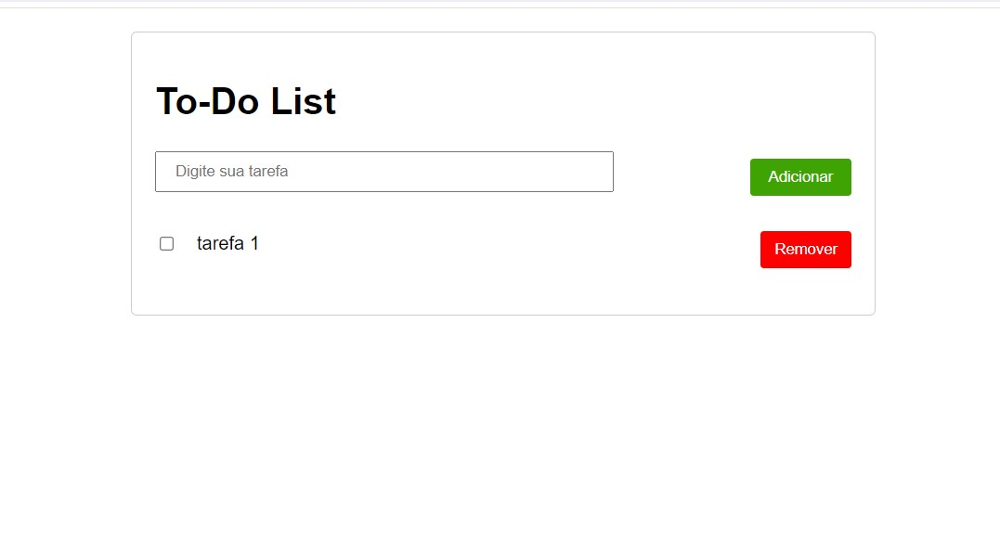
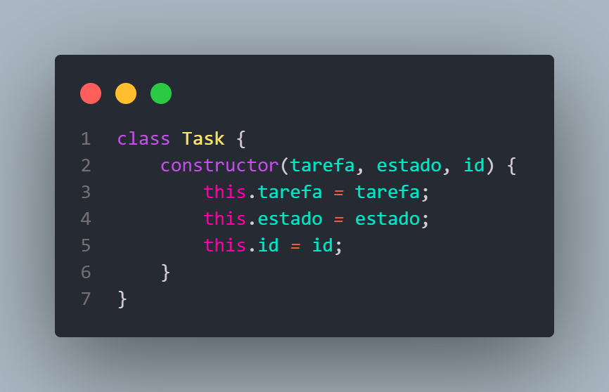
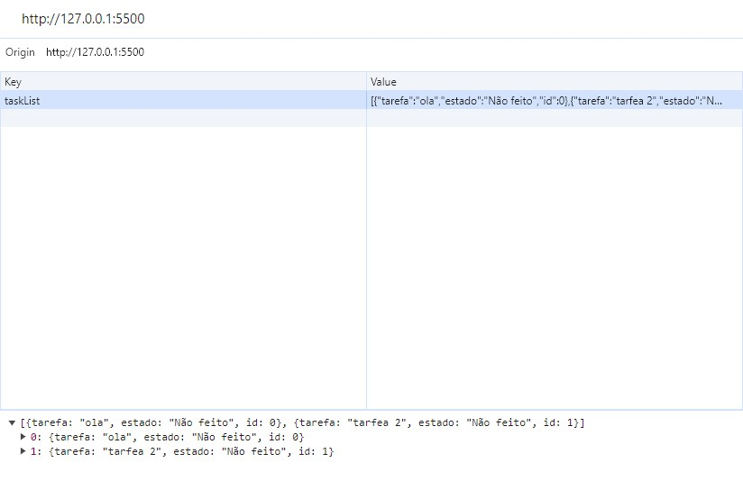
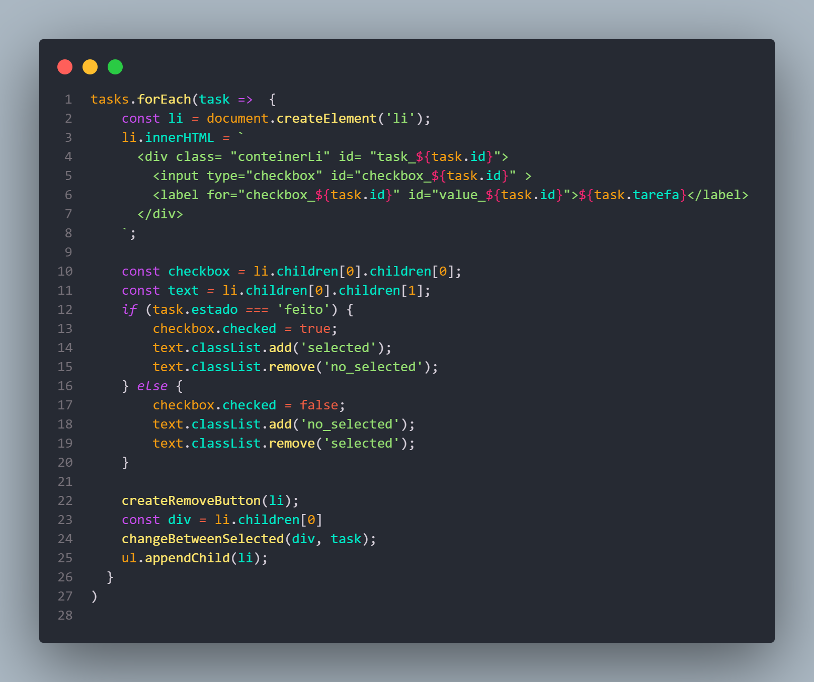

<h1> Olá, este é um projeto To-do List desenvolvido apenas com JS puro</h1>

<h2> Coloquei em prática alguns fundamentos como:
 <li>class 
 <li>manipulaçao de objetos
 <li>get e set do localStorage
 <li>forEach 
 <li>manipulação do DOM 
</h2>
<ul> 

  <li> Toda tarefa criada é salva em formato de um objeto com a descrição da tarefa, o seu estado (concluído ou não concluído) e o seu id, todas são pertencentes a class task.
  
  </li>

  <li> Outra funcionalidade importante é salvar as tasks no LocalStorage, assim mesmo que a página seja atualizada, as tarefas continuarão salvas e sendo renderizadas através de um ForEach. 
   
  
  </li>
</ul>

<h3>Muito Obrigado pela atenção!! </h3>